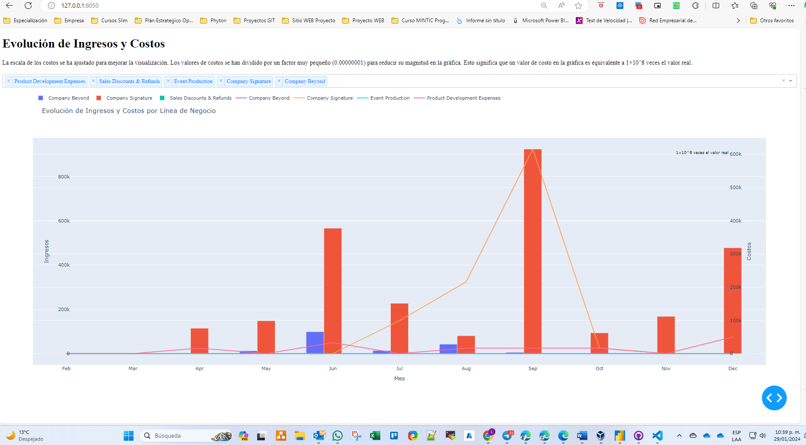

# PruebaPython
 Prueba Tecnica

## scripts/app_Opción_Final. Es la que cumple con lo solicitado



### Explicación:
Este script en Python utiliza la biblioteca Dash (parte de Plotly) para crear un Dashboard web que permite comparar la evolución mensual de ingresos y costos de servicios para una compañía de ejemplo. A continuación, una explicación detallada del script:

Importación de Librerías:
Se importan las bibliotecas necesarias, como Dash para la creación de la aplicación web, pandas para el manejo de datos, y plotly.graph_objects para crear gráficos interactivos.

<pre>
<code>python
```
import dash
from dash import dcc, html
from dash.dependencies import Input, Output
import pandas as pd
import plotly.graph_objects as go
```
</code>
</pre>

Función ETL (Extract, Transform, Load):
La función load_and_process_data se define para cargar y procesar los datos desde un archivo CSV. Realiza ajustes como la eliminación de símbolos de dólar y comas, y la sustitución de puntos por comas en los valores correspondientes a períodos.

<pre>
<code>python
```
def load_and_process_data(file_path):
    df = pd.read_csv(file_path)
    
    # Proceso ETL para eliminar símbolos de dólar y comas
    if 'Client Name' in df.columns:
        df.iloc[:, 4:] = df.iloc[:, 4:].replace('[\$,]', '', regex=True).astype(float)        

    # Reemplazar puntos por comas en todos los valores correspondientes a períodos
    df.iloc[:, 4:] = df.iloc[:, 4:].replace('\.', ',', regex=True)

    return df
```
</code>
</pre>

Carga de Datos:
Se cargan los datos de ingresos (revenue_df) y costos (costs_df) utilizando la función ETL.

<pre>
<code>python
```
# Cargar datos
costs_df = load_and_process_data('data\\costs_2022.csv')
revenue_df = load_and_process_data('data\\revenue_2022.csv')

```
</code>
</pre>

Preprocesamiento Adicional:
Se elimina la palabra "Revenue" del campo 'Line Of Business' en el DataFrame de ingresos.

<pre>
<code>python
```
# Eliminar "Revenue" del campo 'Line Of Business'
revenue_df['Line Of Business'] = revenue_df['Line Of Business'].str.replace(' Revenue', '')

```
</code>
</pre>

Iniciar la Aplicación Dash:
Se inicia la aplicación Dash.

<pre>
<code>python
```
# Iniciar la aplicación Dash
app = dash.Dash(__name__)

```
</code>
</pre>

Diseño del Dashboard:
Se crea el diseño del Dashboard utilizando HTML y Dash components como Dropdown y Graph. La escala de los costos se ha ajustado para grantizar la visualización, debido a que los valores de costo son excesivamente altos en comparación con los ingresos. Los valores de costos se han dividido por un factor muy pequeño (0.00000001) para reducir su magnitud en la gráfica. Esto significa que el valor real de costo es equivalente a 1×10^8 veces el valor en la gráfica.

<pre>
<code>python
```
# Crear el layout del Dashboard
app.layout = html.Div([
    html.H1("Evolución de Ingresos y Costos"),
    
    html.Div([
        html.P("La escala de los costos se ha ajustado para mejorar la visualización. Los valores de costos se han dividido por un factor muy pequeño (0.00000001) para reducir su magnitud en la gráfica. Esto significa que el valor real de costo es equivalente a 1×10^8 veces el valor en la gráfica."),
    ], style={'margin-bottom': '20px'}),

    dcc.Dropdown(
        id='line-of-business-dropdown',
        options=[{'label': i, 'value': i} for i in all_lines],
        multi=True,
        value=all_lines
    ),

    dcc.Graph(id='combined-graph')
])

```
</code>
</pre>

Callback para Actualizar la Gráfica:
Se define un callback que se activa cuando se cambia la selección en el filtro de líneas de negocio. Este callback actualiza la gráfica con la evolución de ingresos y costos.

<pre>
<code>python
```
# Callback para actualizar la gráfica según la selección
@app.callback(
    Output('combined-graph', 'figure'),
    [Input('line-of-business-dropdown', 'value')]
)
def update_graph(selected_lines):
    # Filtrar datos según la selección de líneas de negocio
    filtered_revenue = revenue_df[revenue_df['Line Of Business'].isin(selected_lines)]
    filtered_costs = costs_df[costs_df['Line Of Business'].isin(selected_lines)]

    # Agrupar y sumar los ingresos y costos de cada mes
    grouped_revenue = filtered_revenue.groupby('Line Of Business').sum().iloc[:, 3:-1]
    grouped_costs = filtered_costs.groupby('Line Of Business').sum().iloc[:, 3:-1]

    # Normalizar los costos dividiéndolos por un factor
    cost_scaling_factor = 0.00000001
    scaled_costs = grouped_costs * cost_scaling_factor

    # Crear gráfica con barras para ingresos en el eje Y1
    fig = go.Figure()

    for line in grouped_revenue.index:
        # Añadir barras para los ingresos en el eje Y1
        fig.add_trace(go.Bar(x=grouped_revenue.columns, y=grouped_revenue.loc[line], name=f'{line}', yaxis='y1'))

    # Crear gráfica con líneas para costos en el eje Y2
    for line in scaled_costs.index:
        # Añadir líneas para los costos (valores positivos y normalizados)
        fig.add_trace(go.Scatter(x=grouped_costs.columns, y=scaled_costs.loc[line], mode='lines', name=f'{line}', yaxis='y2'))

    # Establecer títulos de ejes para la gráfica
    fig.update_layout(
        title='Evolución de Ingresos y Costos por Línea de Negocio',
        xaxis={'title': 'Mes'},
        yaxis={'title': 'Ingresos', 'side': 'left', 'position': 0.05},
        yaxis2={'title': 'Costos', 'overlaying': 'y', 'side': 'right', 'position': 0.95},
        legend={'orientation': 'h', 'y': 1.2},
        height=800
    )
    
    # Añadir anotación sobre la escala de los costos
    fig.add_annotation(
        text="1×10^8 veces el valor real",
        xref="paper", yref="paper",
        x=0.95, y=0.95,
        showarrow=False,
        font=dict(size=10, color="black")
    )

    return fig

```
</code>
</pre>

Inicio de la Aplicación:
Finalmente, se inicia la aplicación Dash para que se ejecute en modo de depuración.

<pre>
<code>python
```
# Iniciar la aplicación
if __name__ == '__main__':
    app.run_server(debug=True)

```
</code>
</pre>

Este script crea un Dashboard interactivo que permite explorar y comparar la evolución mensual de ingresos y costos de servicios para diferentes líneas de negocio de la compañía de ejemplo. La escala de los costos se ha ajustado para mejorar la visualización, y se ha añadido una anotación explicativa en la gráfica.

Se anexan dos opciones adicionales que trabaje previamente:
1. app_Opción_1
2. app_Opción_2